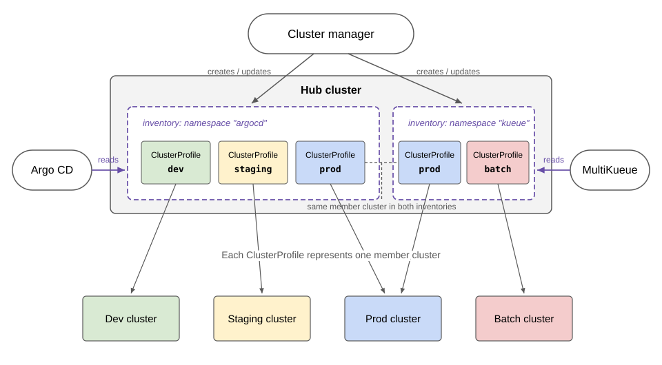
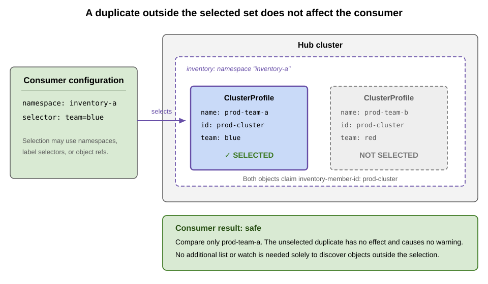
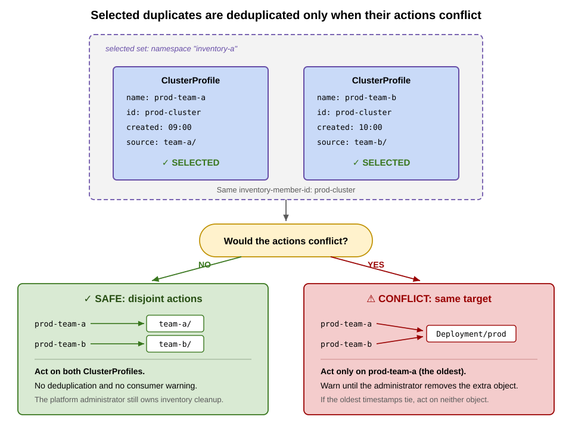

# ClusterProfile API Overview

This document provides an overview of the [ClusterProfile API](https://github.com/kubernetes-sigs/cluster-inventory-api?tab=readme-ov-file#cluster-profile-api).

ClusterProfile is a namespace-scoped resource that describes one member cluster.
It gives cluster managers and consumers a common way to publish and read cluster
properties, status, and access information across
[implementations](../implementations/cluster-inventory-api-implementations.md).

You can read more details about the API in the [KEP-4322](https://github.com/kubernetes/enhancements/blob/master/keps/sig-multicluster/4322-cluster-inventory/README.md).

## Terminology

- **Cluster Inventory**: The ClusterProfile objects in one namespace. See
  [Cluster inventories](#cluster-inventories).

- **Member Cluster**: A Kubernetes cluster represented by a ClusterProfile in a cluster inventory.

- **Cluster Manager**: A controller that creates a ClusterProfile for each
  member cluster and keeps its status up to date. Each cluster manager MUST
  have a unique name, recorded in `spec.clusterManager.name`. Each
  ClusterProfile MUST include the `x-k8s.io/cluster-manager` label with the same
  value. If multiple controllers update status, they use [Server-Side
  Apply](https://kubernetes.io/docs/reference/using-api/server-side-apply/)
  with distinct field managers.

- **ClusterProfile API Consumer**: A controller or tool that reads
  ClusterProfile objects to discover, connect to, or operate on member
  clusters.

## Cluster inventories

A hub cluster can host multiple inventories in separate namespaces. This gives
consumers a single integration point and lets administrators use
namespace-based RBAC to grant each consumer access only to the inventory it
needs.

Inventories can be organized per consumer. In the following example, Argo CD
reads the `argocd` inventory containing the dev, staging, and prod clusters.
MultiKueue reads the `kueue` inventory containing the prod and batch clusters.
The prod cluster appears in both inventories, represented by one ClusterProfile
in each namespace.



Cluster managers differ in how they choose the namespace where they publish
ClusterProfiles. See [Cluster Inventory API
implementations](../implementations/cluster-inventory-api-implementations.md)
for current behavior.

A cluster inventory is independent of a
[ClusterSet](../api-types/cluster-set.md). The `clusterset.k8s.io` property
records ClusterSet membership, not the inventories where a member cluster
appears.

Within an inventory, a member cluster SHOULD be represented by at most one
ClusterProfile, although the same member cluster can appear in different
inventories.

### Identifying duplicate ClusterProfiles

Cluster managers SHOULD add the
`multicluster.x-k8s.io/inventory-member-id` label to each ClusterProfile. The
label MUST have a non-empty value when set, and cluster managers SHOULD keep the
value unchanged while the ClusterProfile represents the same member cluster.
The platform administrator SHOULD coordinate values on the hub so that
ClusterProfiles for the same member cluster use the same value and those for
different member clusters use different values.

A consumer SHOULD compare only the ClusterProfiles selected by its configuration,
such as inventory namespaces, label selectors, or object references. It SHOULD
deduplicate them only when its actions would conflict. Objects outside the
selected set do not affect that consumer and need not be listed or watched solely
for deduplication.

[](../images/cluster-profile-deduplication-selection.svg)

Selecting multiple ClusterProfiles with the same inventory member ID does not
by itself require deduplication. If the consumer can act on all selected objects
without the actions conflicting, it can act on all of them without a warning.
If the actions would conflict, the consumer SHOULD act only on the oldest
object. For conflicting objects in the same inventory, it SHOULD warn until the
platform administrator removes the duplicates.

[](../images/cluster-profile-deduplication-conflicts.svg)

The following cases need additional handling:

| Situation | Behavior |
| --- | --- |
| Two or more conflicting objects share the oldest `creationTimestamp` | The consumer SHOULD NOT act on any of the tied objects. |
| The label is missing or empty | Treat it as absent; do not correlate or deduplicate the object using this mechanism. |
| The same ID appears in different inventories | The objects do not require deletion or a warning solely because they share the ID. If selected, the consumer still applies the conflict rule above. |

Regardless of consumer selection or conflicts, the platform administrator SHOULD
delete all but one ClusterProfile for the same member cluster from each inventory.
See
[KEP-4322](https://github.com/kubernetes/enhancements/blob/master/keps/sig-multicluster/4322-cluster-inventory/README.md#uniqueness-of-the-clusterprofile-object)
for the normative requirements.

## Access to member clusters (`status.accessProviders`)

ClusterProfile describes a cluster, but it does not define a single universal way to authenticate to that cluster.
Different environments have different credential sources (cloud IAM tokens, in-cluster Secrets, external identity systems, etc.).

To make multicluster controllers interoperable, `status.accessProviders` standardizes the **reachability details** for a cluster
and provides enough information for a consumer to select an **external credentials provider** mechanism (plugin) to obtain credentials.

- **What `accessProviders` is**: A list of named access provider entries. Each entry represents one way a consumer can connect to the member cluster.
  - **`name`**: The access provider type identifier (for example `google` or `secretreader`). Consumers can use this value to select a matching credential provider plugin.
  - **`cluster`**: Connection details that reuse the kubeconfig `Cluster` schema (for example `server`, `certificate-authority-data`, `proxy-url`).

- **What `accessProviders` is not**: It is **not** a place to store credentials. Tokens, client certs, and other secrets should not appear in ClusterProfile.
  Consumers are expected to obtain credentials out-of-band, typically via an exec-style credential provider plugin as described in
  [KEP-5339](https://github.com/kubernetes/enhancements/blob/master/keps/sig-multicluster/5339-clusterprofile-plugin-credentials/README.md).

### Selecting an access provider

`status.accessProviders` is written by the cluster manager (or its extensions) and treated as read-only by consumers.
If multiple access providers are present, consumers typically select an entry by `name` based on what credential provider plugins they support.

### Plugin configuration (`cluster.extensions`)

Some credential providers need extra parameters (for example a `clusterName`) in order to fetch credentials.
These parameters should be **per-cluster** and **non-secret**, and must not include controller- or environment-specific data.
When plugin-specific per-cluster configuration is needed, use the Kubernetes client authentication API exec plugin mechanism.
See the reference for the exact schema and semantics:
[client authentication API: `Cluster.config` for exec plugins](https://kubernetes.io/docs/reference/config-api/client-authentication.v1/#client-authentication-k8s-io-v1beta1-Cluster)

## API Example

[CRD definition](https://github.com/kubernetes-sigs/cluster-inventory-api/blob/main/config/crd/bases/multicluster.x-k8s.io_clusterprofiles.yaml)

```yaml
apiVersion: multicluster.x-k8s.io/v1alpha2
kind: ClusterProfile
metadata:
  name: some-cluster-name
  namespace: fleet-system
  labels:
    x-k8s.io/cluster-manager: some-cluster-manager
    multicluster.x-k8s.io/inventory-member-id: cluster-us-east
spec:
  displayName: some-cluster
  clusterManager:
    name: some-cluster-manager
status:
  version:
    kubernetes: "1.28.0"
  properties:
    - name: clusterset.k8s.io
      value: some-clusterset
    - name: location
      value: apac
  accessProviders:
    - name: secretreader
      cluster:
        server: https://api.some-cluster.example:6443
        certificate-authority-data: <base64-encoded-ca>
        extensions:
          - name: client.authentication.k8s.io/exec
            extension:
              clusterName: some-cluster-name
  conditions:
    - type: ControlPlaneHealthy
      status: "True"
      reason: AsExpected
      lastTransitionTime: "2023-05-08T07:56:55Z"
      message: ""
    - type: Joined
      status: "True"
      reason: ClusterRegistered
      lastTransitionTime: "2023-05-08T07:58:55Z"
      message: ""
```
